# Results

## Dataset Links

| Dataset    | Main Page | Variants | Timing | Correlation | Efficiency | Heatmap | Violin |
|------------|-----------|----------|--------|-------------|------------|---------|--------|
| **Synthetic** | [synthetic](https://abbaselmas.github.io/Phd-Evaluation/html/synthetic/synthetic.html)    | [synthetic4](https://abbaselmas.github.io/Phd-Evaluation/html/synthetic/synthetic4.html), [syntheticAll4](https://abbaselmas.github.io/Phd-Evaluation/html/synthetic/syntheticAll4.html)  | [synthetic Timing](https://abbaselmas.github.io/Phd-Evaluation/html/synthetic/syntheticTiming.html) / [Mobile](https://abbaselmas.github.io/Phd-Evaluation/html/synthetic/syntheticTiming_mobile.html) / [Mobile2](https://abbaselmas.github.io/Phd-Evaluation/html/synthetic/syntheticTiming_mobile2.html) | [synthetic Correlation](https://abbaselmas.github.io/Phd-Evaluation/html/synthetic/synthetic_Correlation.html)    | [synthetic Efficiency](https://abbaselmas.github.io/Phd-Evaluation/html/synthetic/synthetic_Efficiency.html)  | [synthetic Heatmap](https://abbaselmas.github.io/Phd-Evaluation/html/synthetic/synthetic_Heatmap.html)    | [synthetic Violin](https://abbaselmas.github.io/Phd-Evaluation/html/synthetic/synthetic_Violin.html)  |
| **Oxford**    | [oxford](https://abbaselmas.github.io/Phd-Evaluation/html/oxford/oxford.html)             | [oxford9](https://abbaselmas.github.io/Phd-Evaluation/html/oxford/oxford9.html),          [oxfordAll9](https://abbaselmas.github.io/Phd-Evaluation/html/oxford/oxfordAll9.html)           | [oxford Timing](https://abbaselmas.github.io/Phd-Evaluation/html/oxford/oxfordTiming.html) / [Mobile](https://abbaselmas.github.io/Phd-Evaluation/html/oxford/oxfordTiming_mobile.html) / [Mobile2](https://abbaselmas.github.io/Phd-Evaluation/html/oxford/oxfordTiming_mobile2.html)  | [oxford Correlation](https://abbaselmas.github.io/Phd-Evaluation/html/oxford/oxford_Correlation.html)             | [oxford Efficiency](https://abbaselmas.github.io/Phd-Evaluation/html/oxford/oxford_Efficiency.html)           | [oxford Heatmap](https://abbaselmas.github.io/Phd-Evaluation/html/oxford/oxford_Heatmap.html)             | [oxford Violin](https://abbaselmas.github.io/Phd-Evaluation/html/oxford/oxford_Violin.html)           |
| **Drone**     | [drone](https://abbaselmas.github.io/Phd-Evaluation/html/drone/drone.html)                | [droneAll](https://abbaselmas.github.io/Phd-Evaluation/html/drone/droneAll.html)                                                                                                          | [drone Timing](https://abbaselmas.github.io/Phd-Evaluation/html/drone/droneTiming.html)                                                                                                                 | [drone Correlation](https://abbaselmas.github.io/Phd-Evaluation/html/drone/drone_Correlation.html)                | [drone Efficiency](https://abbaselmas.github.io/Phd-Evaluation/html/drone/drone_Efficiency.html)              | [drone Heatmap](https://abbaselmas.github.io/Phd-Evaluation/html/drone/drone_Heatmap.html)                | [drone Violin](https://abbaselmas.github.io/Phd-Evaluation/html/drone/drone_Violin.html)              |
| **UAV**       | [uav](https://abbaselmas.github.io/Phd-Evaluation/html/uav/uav.html)                      | [uavAll](https://abbaselmas.github.io/Phd-Evaluation/html/uav/uavAll.html)                                                                                                                | [uavTiming](https://abbaselmas.github.io/Phd-Evaluation/html/uav/uavTiming.html)                                                                                                                        | [uav Correlation](https://abbaselmas.github.io/Phd-Evaluation/html/uav/uav_Correlation.html)                      | [uav Efficiency](https://abbaselmas.github.io/Phd-Evaluation/html/uav/uav_Efficiency.html)                    | [uav Heatmap](https://abbaselmas.github.io/Phd-Evaluation/html/uav/uav_Heatmap.html)                      | [uav Violin](https://abbaselmas.github.io/Phd-Evaluation/html/uav/uav_Violin.html)                    |
| **AirSim**    | [airsim](https://abbaselmas.github.io/Phd-Evaluation/html/airsim/airsim.html)             | [airsimAll](https://abbaselmas.github.io/Phd-Evaluation/html/airsim/airsimAll.html)                                                                                                       | [airsimTiming](https://abbaselmas.github.io/Phd-Evaluation/html/airsim/airsimTiming.html)                                                                                                               | [airsim Correlation](https://abbaselmas.github.io/Phd-Evaluation/html/airsim/airsim_Correlation.html)             | [airsim Efficiency](https://abbaselmas.github.io/Phd-Evaluation/html/airsim/airsim_Efficiency.html)           | [airsim Heatmap](https://abbaselmas.github.io/Phd-Evaluation/html/airsim/airsim_Heatmap.html)             | [airsim Violin](https://abbaselmas.github.io/Phd-Evaluation/html/airsim/airsim_Violin.html)           |

## Visualizations

### Synthetic Dataset

| Intensity | Intensity Results | Rotation Results | Scale Results |
|---------------------|--------------------------------------------------------------------------|--------------------------------------------------------------------|----------------------------------------------------------------------|
|AKAZE-SIFT-L2-BF     |           |           |           |
|AKAZE-SIFT-L2-Flann  |        |        |        |
|AKAZE-DAISY-L2-BF    |         |         |          |
|AKAZE-DAISY-L2-Flann |      |      |          |
|ORB-ORB-HAM-BF       |                |                |                |
|ORB-ORB-HAM-Flann    |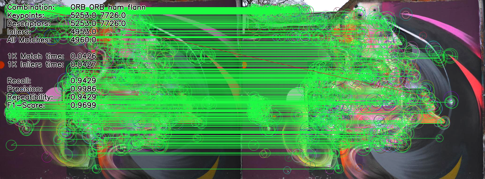             |             |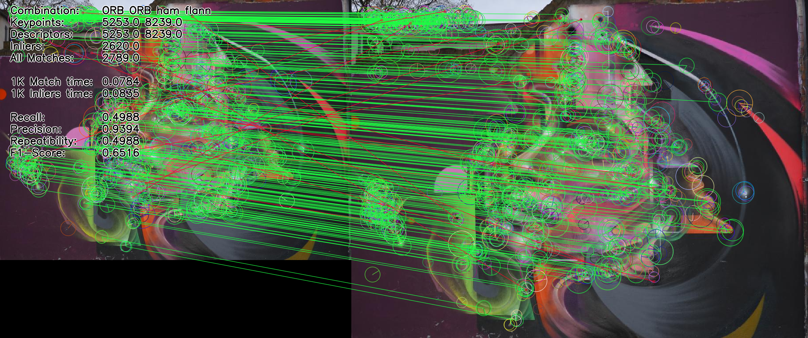             |
|ORB-ORB-L2-BF        |                 |                 |                 |
|ORB-BEBLID-HAM-BF    |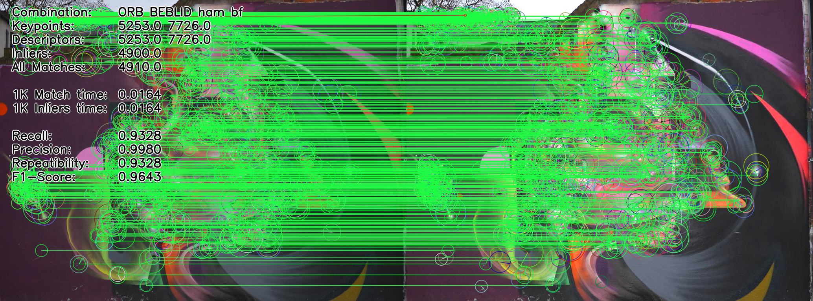         |         |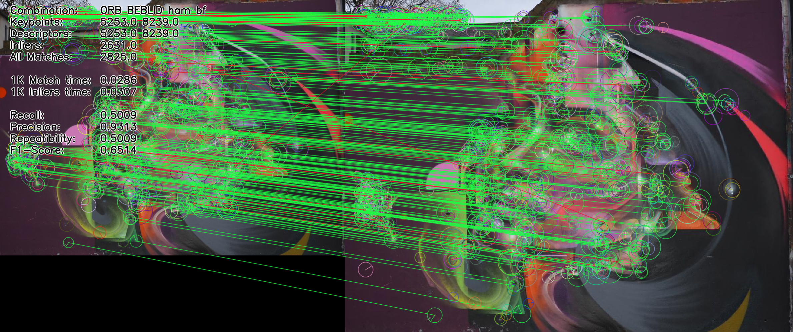         |
|ORB-BEBLID-HAM-Flann |      |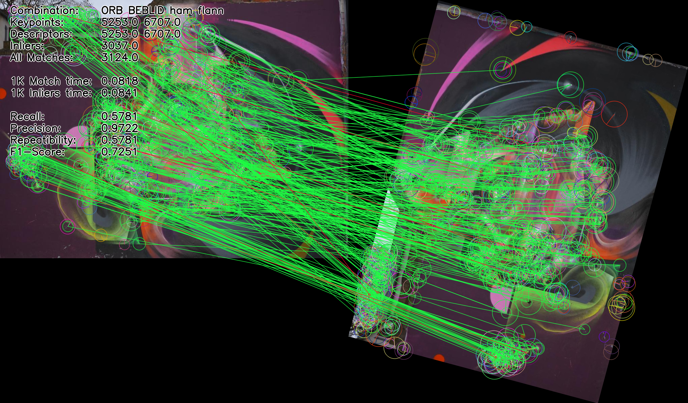      |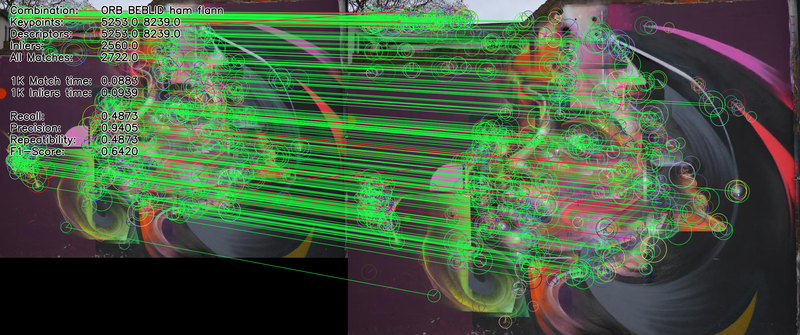      |
|ORB-BEBLID-L2-BF     |          |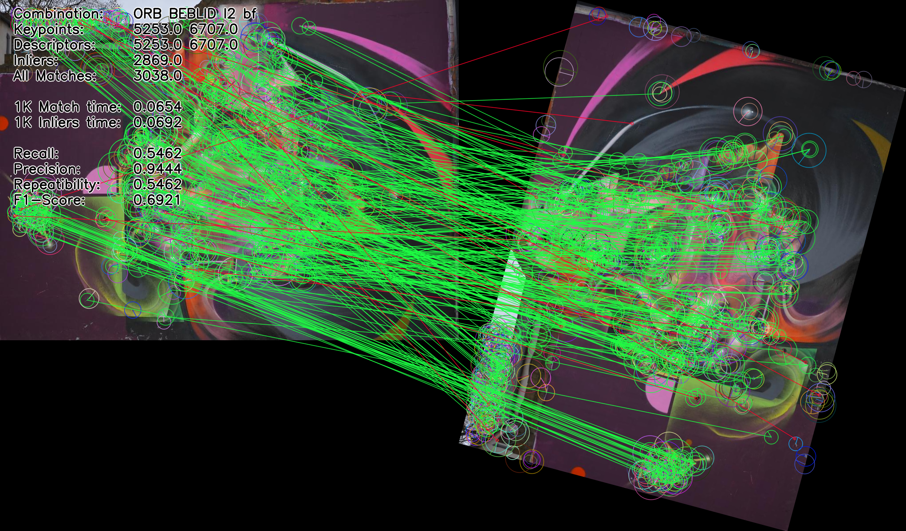          |          |
|KAZE_SIFT-L2-BF      |             |             |             |
|KAZE_SIFT-L2-Flann   |          |          |          |
|GFTT-DAISY-L2-BF     |   |   |   |
|GFTT-DAISY-L2-Flann  ||||

### Oxford Dataset

| Scenarios | bikes | trees | graf | wall |
|-----------------------|----------------------------------------------------------------|----------------------------------------------------------------|---------------------------------------------------------------|---------------------------------------------------------------|
| AKAZE-SIFT-L2-BF      |           |           |           |           |
| AKAZE-SIFT-L2-Flann   |        |        |        |        |
| AKAZE-DAISY-L2-BF     |         |         |         |         |
| AKAZE-DAISY-L2-Flann  |      |      |      |      |
| ORB-ORB-HAM-BF        |                |                |                |                |
| ORB-ORB-HAM-Flann     |             |             |             |             |
| ORB-ORB-L2-BF         |                 |                 |                 |                 |
| ORB-BEBLID-HAM-BF     |         |         |         |         |
| ORB-BEBLID-HAM-Flann  |      |      |      |      |
| ORB-BEBLID-L2-BF      |          |          |          |          |
| KAZE_SIFT-L2-BF       |             |             |             |             |
| KAZE_SIFT-L2-Flann    |          |          |          |          |
| GFTT-DAISY-L2-BF      |   |   |   |   |
| GFTT-DAISY-L2-Flann   |||||

| Scenarios | bark | boat | leuven | ubc |
|-----------------------|----------------------------------------------------------------|----------------------------------------------------------------|---------------------------------------------------------------|---------------------------------------------------------------|
| AKAZE-SIFT-L2-BF      |           |           |           |           |
| AKAZE-SIFT-L2-Flann   |        |        |        |        |
| AKAZE-DAISY-L2-BF     |         |         |         |         |
| AKAZE-DAISY-L2-Flann  |      |      |      |      |
| ORB-ORB-HAM-BF        |                |                |                |                |
| ORB-ORB-HAM-Flann     |             |             |             |             |
| ORB-ORB-L2-BF         |                 |                 |                 |                 |
| ORB-BEBLID-HAM-BF     |         |         |         |         |
| ORB-BEBLID-HAM-Flann  |      |      |      |      |
| ORB-BEBLID-L2-BF      |          |          |          |          |
| KAZE_SIFT-L2-BF       |             |             |             |             |
| KAZE_SIFT-L2-Flann    |          |          |          |          |
| GFTT-DAISY-L2-BF      |   |   |   |   |
| GFTT-DAISY-L2-Flann   |||||

### Drone Dataset

| Method | Visualization |
|----------------------|-----------------------------------------------------------------|
| AKAZE-SIFT-L2-BF     |           |
| AKAZE-SIFT-L2-Flann  |        |
| AKAZE-DAISY-L2-BF    |         |
| AKAZE-DAISY-L2-Flann |      |
| ORB-ORB-HAM-BF       |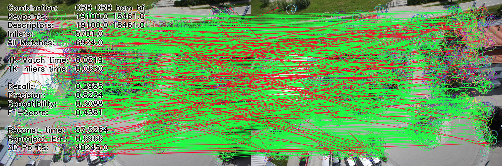                |
| ORB-ORB-HAM-Flann    |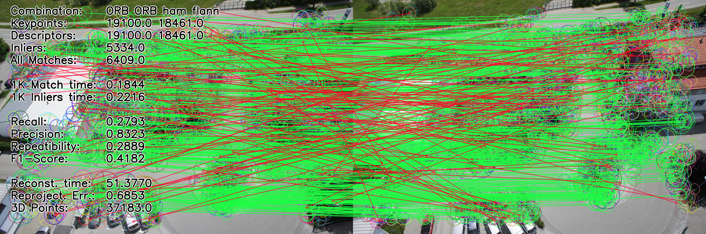             |
| ORB-ORB-L2-BF        |                 |
| ORB-BEBLID-HAM-BF    |         |
| ORB-BEBLID-HAM-Flann |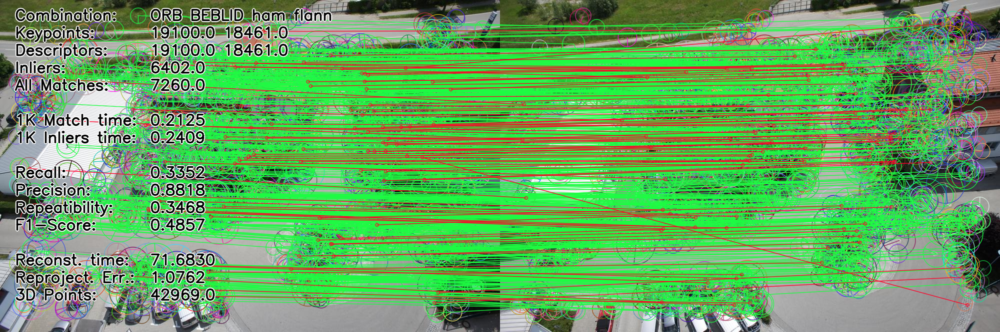      |
| ORB-BEBLID-L2-BF     |          |
| KAZE_SIFT-L2-BF      |             |
| KAZE_SIFT-L2-Flann   |          |
| GFTT-DAISY-L2-BF     |   |
| GFTT-DAISY-L2-Flann  |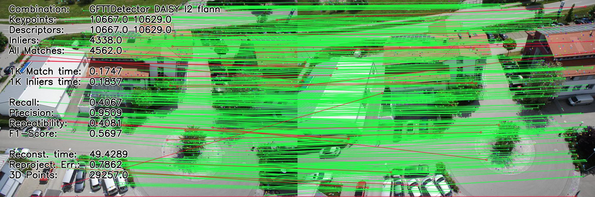|

### UAV Dataset

| Method | 0 | 1 | 2 | 3 | 4 |
|-----------------------|-----------------------------------------------------------------|-----------------------------------------------------------------|-----------------------------------------------------------------|-----------------------------------------------------------------|-----------------------------------------------------------------|
| AKAZE-SIFT-L2-BF      |           |           |           |           |           |
| AKAZE-SIFT-L2-Flann   |        |        |        |        |        |
| AKAZE-DAISY-L2-BF     |         |         |         |         |         |
| AKAZE-DAISY-L2-Flann  |      |      |      |      |      |
| ORB-ORB-HAM-BF        |                |                |                |                |                |
| ORB-ORB-HAM-Flann     |             |             |             |             |             |
| ORB-ORB-L2-BF         |                 |                 |                 |                 |                 |
| ORB-BEBLID-HAM-BF     |         |         |         |         |         |
| ORB-BEBLID-HAM-Flann  |      |      |      |      |      |
| ORB-BEBLID-L2-BF      |          |          |          |          |          |
| KAZE_SIFT-L2-BF       |             |             |             |             |             |
| KAZE_SIFT-L2-Flann    |          |          |          |          |          |
| GFTT-DAISY-L2-BF      |   |   |   |   |   |
| GFTT-DAISY-L2-Flann   ||||||

| Method | 5 | 6 | 7 | 8 | 9 |
|-----------------------|-----------------------------------------------------------------|-----------------------------------------------------------------|-----------------------------------------------------------------|-----------------------------------------------------------------|-----------------------------------------------------------------|
| AKAZE-SIFT-L2-BF      |           |           |           |           |           |
| AKAZE-SIFT-L2-Flann   |        |        |        |        |        |
| AKAZE-DAISY-L2-BF     |         |         |         |         |         |
| AKAZE-DAISY-L2-Flann  |      |      |      |      |      |
| ORB-ORB-HAM-BF        |                |                |                |                |                |
| ORB-ORB-HAM-Flann     |             |             |             |             |             |
| ORB-ORB-L2-BF         |                 |                 |                 |                 |                 |
| ORB-BEBLID-HAM-BF     |         |         |         |         |         |
| ORB-BEBLID-HAM-Flann  |      |      |      |      |      |
| ORB-BEBLID-L2-BF      |          |          |          |          |          |
| KAZE_SIFT-L2-BF       |             |             |             |             |             |
| KAZE_SIFT-L2-Flann    |          |          |          |          |          |
| GFTT-DAISY-L2-BF      |   |   |   |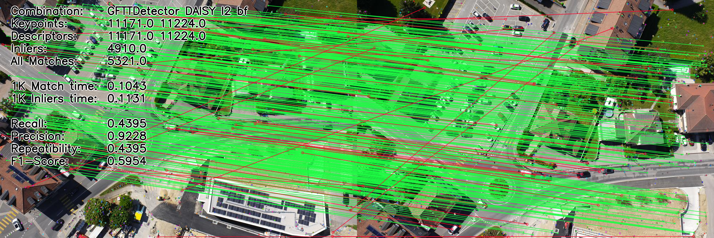   |   |
| GFTT-DAISY-L2-Flann   ||||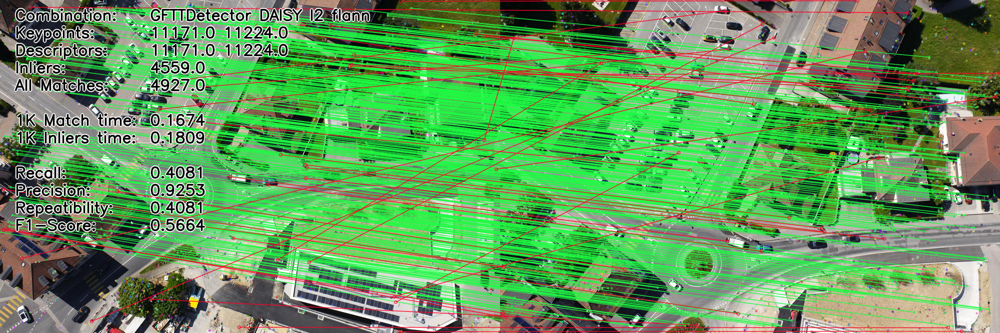||

### AirSim Dataset

| Method | Visualization |
|-----------------------|-----------------------------------------------------------------|
| AKAZE-SIFT-L2-BF      |           |
| AKAZE-SIFT-L2-Flann   |        |
| AKAZE-DAISY-L2-BF     |         |
| AKAZE-DAISY-L2-Flann  |      |
| ORB-ORB-HAM-BF        |                |
| ORB-ORB-HAM-Flann     |             |
| ORB-ORB-L2-BF         |                 |
| ORB-BEBLID-HAM-BF     |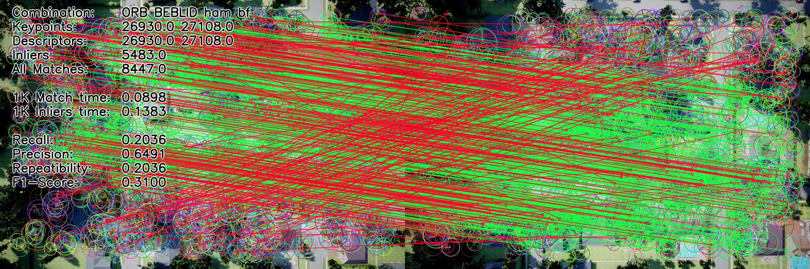         |
| ORB-BEBLID-HAM-Flann  |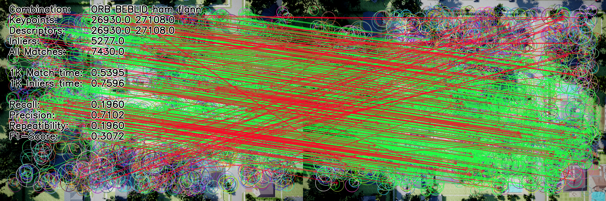      |
| ORB-BEBLID-L2-BF      |          |
| KAZE_SIFT-L2-BF       |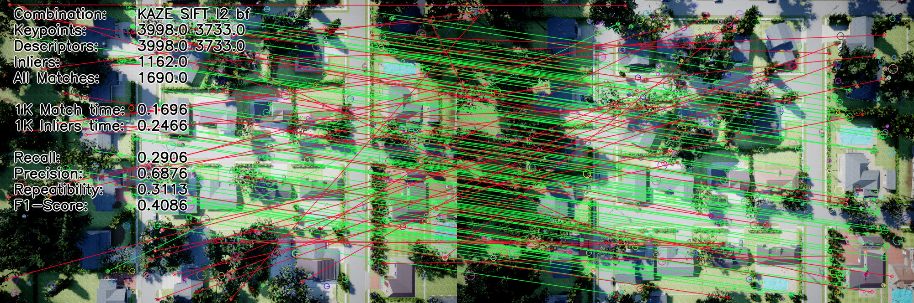             |
| KAZE_SIFT-L2-Flann    |          |
| GFTT-DAISY-L2-BF      |   |
| GFTT-DAISY-L2-Flann   ||
